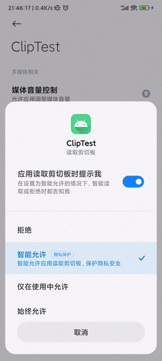

# HideMiuiClipboardDialog

隐藏miui剪贴板对话框

# 下载

https://github.com/zerorooot/HideMiuiClipboardDialog/releases

# 缘由

miui的隐私防护，特别是剪贴板防护，对我而言没有太大提升，反而影响到了日常使用。复制文字后，打开啥软件都提醒。这也就算了，多点一点允许/拒绝就行，但tm的有时候会造成app卡死或者着急使用的时候给你xjb弹一个，烦不胜烦。而且miui也没提供一键允许的选项。综合以上痛点，便有了此软件。在app读取剪贴板权限中，设置“智能允许”读取的app，隐藏剪贴板对话框，同时Toast提示此app读取了剪贴板；其他情况的照旧，不影响app正常使用。

# 演示

